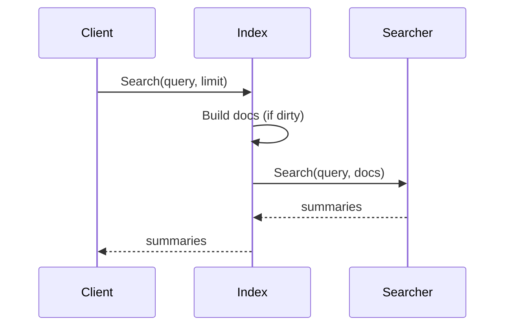

# Architecture

`toolindex` maintains a canonical map of tools and a cached search document set.
It is optimized for frequent reads and infrequent writes.

## Registration + search flow

```mermaid
flowchart LR
  A[RegisterTool(s)] --> B[toolRecord map]
  B --> C[SearchDoc cache]
  C --> D[Searcher]
  D --> E[Summary list]

  B --> F[GetTool]
  B --> G[ListNamespaces]
```

## Search sequence



## Progressive disclosure contract

- `Search` returns summaries only
- Schema and examples are retrieved later via `tooldocs`

## Default backend policy

The default backend selector prefers:

1. local
2. provider
3. mcp

Exported as `toolindex.DefaultBackendSelector`.
