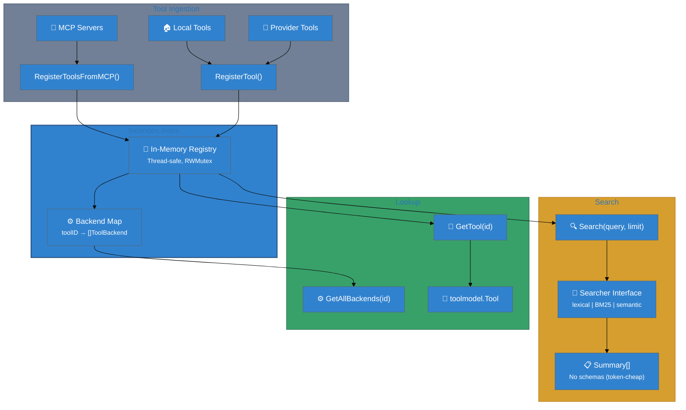

# User Journey

This journey shows how `toolindex` supports end-to-end agent workflows by powering discovery and canonical lookup.

## End-to-end flow (stack view)




## Step-by-step

1. **Ingest tools** from MCP servers or local registries:
   - `RegisterToolsFromMCP(serverName, tools)`
   - `RegisterTool(tool, backend)` for local/provider tools
2. **Agent discovers tools** via `search_tools` (summary only).
3. **Agent selects a tool ID** and requests schema/docs (`describe_tool`).
4. **Agent executes** via `run_tool` or `run_chain`.

## Example: register and search

```go
idx := toolindex.NewInMemoryIndex()

// MCP-backed tools
_ = idx.RegisterToolsFromMCP("github", []toolmodel.Tool{repoTool})

// Local tool
_ = idx.RegisterTool(localTool, toolmodel.ToolBackend{
  Kind: toolmodel.BackendKindLocal,
  Local: &toolmodel.LocalBackend{Name: "local_handler"},
})

summaries, _ := idx.Search("repo", 5)
for _, s := range summaries {
  fmt.Println(s.ID, s.ShortDescription)
}
```

## Expected outcomes

- Fast, deterministic search results.
- Stable tool IDs across backends.
- Safe summaries for progressive disclosure.

## Common failure modes

- `ErrInvalidTool` when tool validation fails.
- `ErrInvalidBackend` when backend metadata is incomplete.
- `ErrNotFound` for missing tool IDs or backends.

## Why this matters

`toolindex` is the “front door” for tool discovery. It keeps discovery cheap and consistent while letting execution and documentation happen elsewhere.
